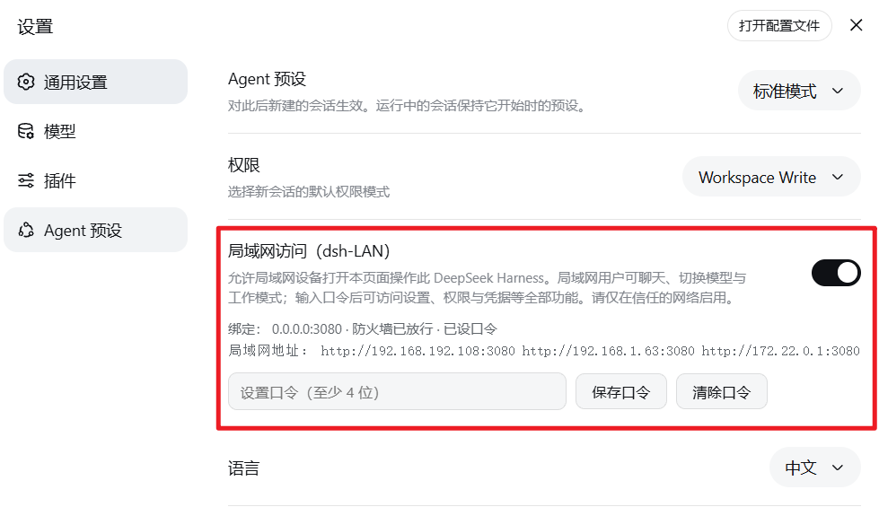
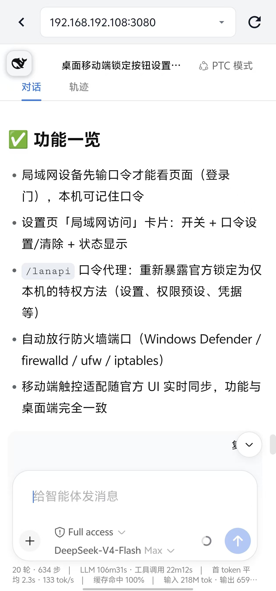

# dsh-LAN

dsh-LAN — a plugin that brings the [deepseek-harness](https://github.com/deepseek-ai/deepseek-harness) Web GUI to your local network (password-protected full-featured edition; mobile reuses the official desktop UI with an injected portrait touch adaptation).

> 🚀 **Pair it with [DSH-Launcher](https://github.com/MrMu666/DSH-Launcher) and [dsh-app](https://github.com/MrMu666/dsh-app) for a better experience.**

Once installed, the Web GUI binds to `0.0.0.0` (all network interfaces) by default and automatically opens the host firewall port (Windows: Windows Defender Firewall Domain + Private; Linux: firewalld / ufw / iptables are tried in order, and a missing firewall tool is treated as "no rule needed"):

- ✅ **LAN devices must enter a password before seeing any page**: any device (desktop or phone/tablet) opening `http://<host-ip>:3080` gets a full-screen login gate first and enters only after the password is verified; on a portrait phone the plugin injects a mobile-touch adaptation (big touch targets, 16px input font, safe areas) over the official UI — the same interface as desktop, synced with the host in real time
- ✅ **Remember password (per device)**: Checking "Remember password" at login stores the password in that browser's localStorage, so the next visit skips it; otherwise it is kept only in the current tab (sessionStorage) and expires when the tab closes
- ✅ "LAN access" card in Settings → General: toggle + password set/clear + status display
- ✅ Once unlocked, all features are available: settings, permission presets, credentials, preset management (privileged methods that the official client pins to localhost are re-exposed through the password-protected `/lanapi` proxy channel)
- ✅ **Every browser sees the exact same conversation**: a single service process holds all session state server-side, and the event stream (`/api/events.mux` WebSocket) pushes identical updates to every connected browser

> 💡 **The simplest way to install: tell DSH to install the dsh-LAN plugin.**

<div align="center">





</div>

## ⚠️ Security notes

- The login gate is **UI-level** protection: people without the password cannot see page content; privileged operations (settings/permissions/credentials) are enforced **server-side** by password checks.
- Non-privileged APIs (session read/write, etc.) remain open to the LAN at the API layer — the gate mainly stops casual passers-by from opening the page. For stronger API-level lockdown, turn the LAN switch off outside trusted networks.
- Use only on trusted networks (home/office intranet). Turn the switch off on public networks.

## Mobile (portrait phones/tablets)

- Mobile **reuses the official desktop UI** — there is no standalone remote UI anymore (v48 removed `/dsh-lan/ui`). When a phone opens `http://<host-ip>:3080` in portrait, the plugin injects a touch adaptation over the official interface (compact sidebar rail, ≥44px touch targets, 16px input font to prevent iOS focus zoom, safe-area padding); landscape/wide viewports revert automatically.
- Every capability is identical to desktop: sessions/workspaces/history/live chat/model & mode switching/todo list/approvals & questions/permission switching, all synced with the host in real time.

### Mobile interaction details

- **Sidebar**: hidden while collapsed — the draggable **whale button** at the top-left is the entry point (its drag position is remembered). Tapping a session row, tapping anywhere else, or **swiping left** collapses it; in the conversation view **swiping right** expands the sidebar directly.
- **Keyboard**: the page never auto-focuses the composer on load, tapping the whale does not pop the keyboard, and Enter inserts a newline only (sending goes through the send button).
- **UI details**: lingering official Tooltip bubbles are hidden (e.g. collapse/send black tooltips); the `ask_user_question` card is fully adapted to narrow screens (42px option touch targets); the permission/model two-line layout and the bottom stats bar stay aligned with the composer.
- **LAN privileged channel**: privileged calls pinned to localhost by the official client (settings/credentials…) are rewritten to the `/lanapi` password channel at the network layer — preset/permission labels now show their localized names on LAN devices.

## Installation (patch path, no restart required — recommended)

### Windows 11

```powershell
powershell -ExecutionPolicy Bypass -File install.ps1
# optional:
powershell -ExecutionPolicy Bypass -File install.ps1 -DshHome C:\Users\me\.dsh -Profile web
```

### Linux / macOS

```bash
./install.sh
# optional:
./install.sh --dsh-home "$HOME/.dsh" --profile web
# the DSH_HOME environment variable is also honored (same as dsh)
```

The installers (equivalent on both platforms):

- copy the plugin package to `<DSH_HOME>/profiles/node_modules/dsh-LAN` (on Windows: `%USERPROFILE%\.dsh\profiles\node_modules\dsh-LAN`)
- write the install block to `<DSH_HOME>/profiles/web/cordis.patch.yml` (bind 0.0.0.0 + plugin mount line)
- **DSH hot-reloads profile patches**: the running service picks it up immediately, no restart needed; just refresh the browser to see the settings card
- **Restart `dsh web` after upgrading plugin code**: the node half (`lib/index.js`) lives in process memory and hot reload only reloads the patch layer; the client bundle is picked up by refreshing the browser

### Firewall notes

- **Windows**: a Windows Defender Firewall allow rule (Domain + Private) is maintained automatically; without an elevated shell the settings card reports "firewall blocked (needs admin)".
- **Linux**: an allow rule is maintained via firewalld → ufw → iptables (first available). When no supported firewall tool is found the card reports "firewall not managed", which normally means the port is already reachable. If a firewall is detected but root is missing, it reports that admin rights are needed.
- On every platform, turning the "LAN access" toggle off falls back to binding `127.0.0.1` — that is the primary security switch.

### Installation (bundle path, optional)

```bash
dsh plugin --profile web add link:<absolute-path-to-this-directory>
```

The package declares `dsh.bundle.patch`, so `dsh plugin` automatically adds it to the bundles list. This path requires a service restart to take effect.

## Usage

1. On the host, open Settings → General → "LAN access", make sure the toggle is on, the firewall is allowed, and **set a password** (at least 4 characters);
2. LAN browser (desktop or phone/tablet): open `http://<host-ip>:3080` → enter the password at the login gate (check "Remember password" to skip it next time);
3. On a portrait phone the touch adaptation kicks in automatically (same UI as desktop); the sidebar's bottom-left "Lock" button (right above the settings button, same style) logs out at any time;
4. After the host changes the password, other devices are asked to log in again on their next action (403 returns to the login gate automatically).

## Uninstall

Windows:

```powershell
powershell -ExecutionPolicy Bypass -File uninstall.ps1
```

Linux / macOS:

```bash
./uninstall.sh
# optional: ./uninstall.sh --dsh-home "$HOME/.dsh" --profile web --port 3080
```

Removes the patch block, firewall rules, and the package copy; takes effect via hot reload, no restart needed.

## How multi-device consistency works

A single DSH service process holds all state: sessions (jsonl persistence + in-memory projections), workspaces, targets, and subagents. Every browser is just a client of the same service: it reads/writes the same state through `/api` RPC and receives the same server-side event pushes over `/api/events.mux` (WebSocket downlink). Desktop and mobile connect to the same state, so any action on either end is visible in real time on all other ends.

## Credits

Early mobile work referenced [dsh-remote-web-ui from dsh-web-ui](https://github.com/zhu1090093659/dsh-web-ui) (standalone lightweight remote UI + token gate); since v48 mobile reuses the official desktop UI with an injected portrait adaptation, keeping the same password model (persistent password + per-device remember + `/lanapi` privileged proxy).

## License

[MIT](package.json) (`license: MIT`)
